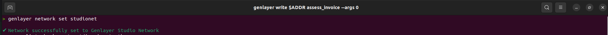
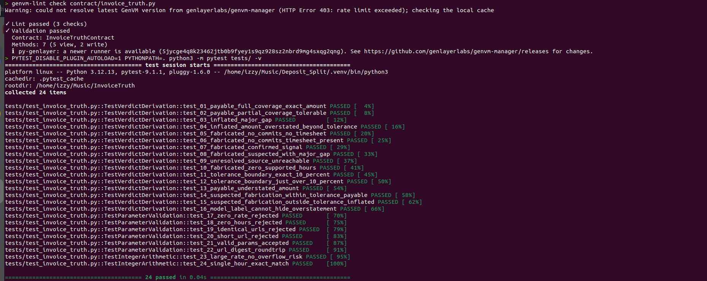
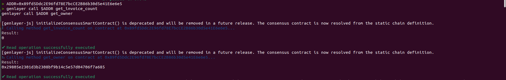
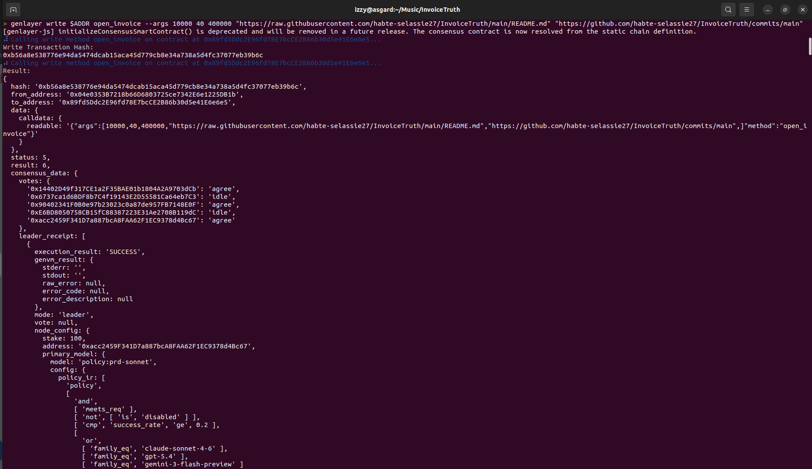
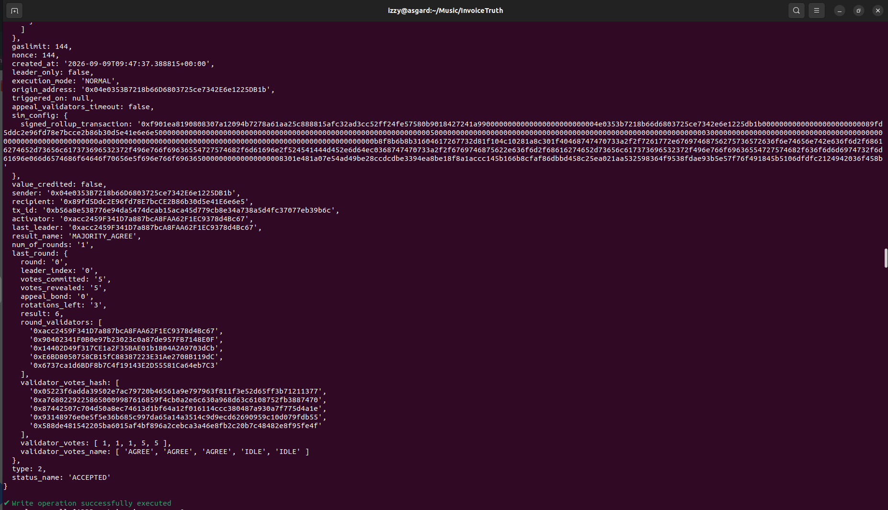
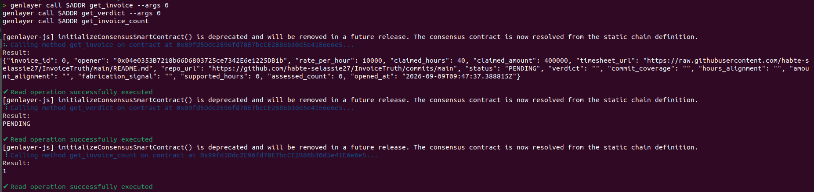
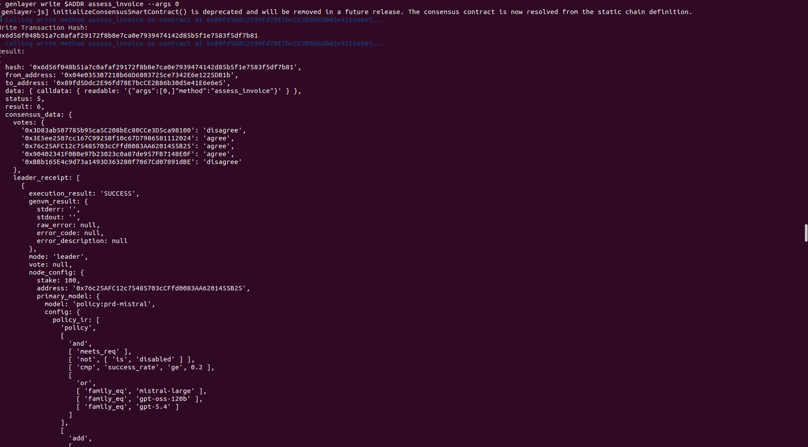
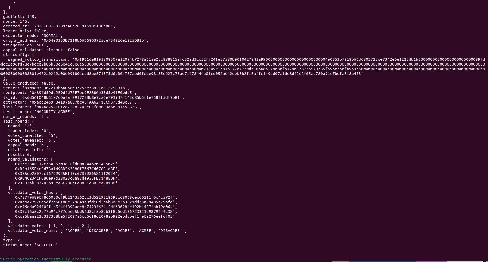
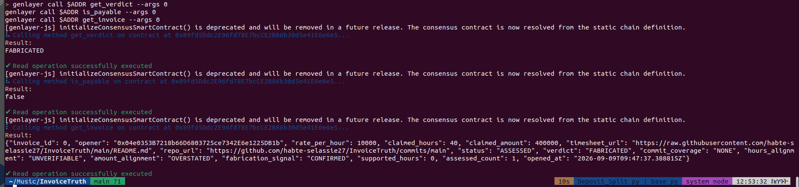

<p align="center">
  
</p>

<p align="center">
  <em>Intelligent Contract that verifies freelance invoices via validator consensus</em>
</p>

<p align="center">
  <a href="https://explorer-studio.genlayer.com/address/0x89fd5Ddc2E96fd78E7bcCE2B86b30d5e41E6e6e5">Live on studionet</a> &middot;
  <a href="RUBRIC.md">Scoring Rubric</a>
</p>

---

A standalone GenLayer Intelligent Contract that determines whether a sealed freelance invoice is **PAYABLE**, **INFLATED**, or **FABRICATED** by cross-referencing a public timesheet URL and a repository commit log against the claimed hours and agreed hourly rate.

## Problem

Freelance disputes almost always reduce to one question: *do the commits and timesheet actually support the hours billed?* No neutral, automated, on-chain answer existed. InvoiceTruth solves this by letting GenLayer validators independently fetch both evidence sources, run a narrow AI assessment, and have deterministic contract logic — not the model — issue the final verdict.

## How It Works

### 1. Opening an Invoice

The **client** calls `open_invoice(rate, claimed_hours, claimed_amount, timesheet_url, repo_url)`. This seals five immutable parameters on-chain:

| Param | Description |
|---|---|
| `rate_per_hour` | Agreed hourly rate in smallest currency unit (integer) |
| `claimed_hours` | Hours the freelancer claims |
| `claimed_amount` | Total billed = rate × hours (integer; must match or triggers INFLATED) |
| `timesheet_url` | Publicly accessible timesheet / time-tracking export |
| `repo_url` | Publicly accessible commit log (GitHub, GitLab, Gogs, etc.) |

Neither URL can be changed after opening. Returns an `invoice_id`.

### 2. Assessment (Validator Consensus)

Anyone calls `assess_invoice(invoice_id)`. This triggers GenLayer's consensus layer:

**Each validator independently:**
1. Fetches `timesheet_url` via `gl.nondet.web.get`
2. Fetches `repo_url` via `gl.nondet.web.get`
3. Runs an LLM prompt that returns **five closed observations** in JSON:

```json
{
  "commit_coverage": "FULL | PARTIAL | NONE",
  "hours_alignment": "CONSISTENT | MINOR_GAP | MAJOR_GAP | UNVERIFIABLE",
  "amount_alignment": "EXACT | TOLERABLE | OVERSTATED | UNDERSTATED",
  "fabrication_signal": "NONE | SUSPECTED | CONFIRMED",
  "supported_hours_seen": <integer>,
  "claimed_hours_seen": <integer>
}
```

**Equivalence check binds all seven fields exactly** (`source_reachable` plus the six above)**.** Validators must agree on every dimension; free-form wording is never stored.

### 3. Deterministic Verdict Derivation

The contract — not the model — maps validator observations to a verdict using a strict priority-ordered rule set (integer math only, no floats):

| Priority | Condition | Verdict |
|---|---|---|
| 1 | `fabrication_signal == CONFIRMED` | **FABRICATED** |
| 2 | `commit_coverage == NONE AND hours_alignment == UNVERIFIABLE` | **FABRICATED** |
| 3 | `commit_coverage == NONE` (timesheet alone is insufficient) | **FABRICATED** |
| 4 | `fabrication_signal == SUSPECTED AND hours_alignment == MAJOR_GAP` | **FABRICATED** |
| 5 | `supported_hours == 0` | **FABRICATED** |
| 6 | `hours_alignment == MAJOR_GAP` | **INFLATED** |
| 7 | `amount_alignment == OVERSTATED AND delta × 10 > expected` | **INFLATED** |
| 8 | `(MINOR_GAP OR SUSPECTED) AND delta × 10 > expected` | **INFLATED** |
| 9 | All checks pass | **PAYABLE** |

The 10% tolerance in rules 7–8 is recomputed from integers, so a dishonest model label cannot force PAYABLE.

### 4. Integer-Only Math

The 10% tolerance check uses no floating point:

```
expected = supported_hours × rate_per_hour
delta = |claimed_amount − expected|
within_tolerance = (delta × 10) ≤ expected
```

This is equivalent to `delta ≤ expected × 0.1` without any division.

## Verdict Reference

| Verdict | Meaning |
|---|---|
| `PAYABLE` | Hours supported by both timesheet and commits; billed amount within 10% of rate × supported hours |
| `INFLATED` | Some work evidenced but billed hours exceed supported evidence |
| `FABRICATED` | No credible commit/timesheet evidence; strong fabrication signals |
| `UNRESOLVED` | Evidence URL(s) unreachable; status = UNRESOLVABLE; retry allowed |

## Lifecycle

```
open_invoice()
     │
     ▼
  PENDING
     │
     ▼  assess_invoice()
  ┌──────────────────────────┐
  │  validators fetch URLs   │
  │  LLM → 5 closed fields   │
  │  eq_principle binds all  │
  └──────────────────────────┘
     │
     ├─── source unreachable ──→ UNRESOLVABLE (retry allowed)
     │
     └─── verdict derived ────→ ASSESSED (terminal)
                                  ├── PAYABLE
                                  ├── INFLATED
                                  └── FABRICATED
```

Terminal assessments are replay-protected; `assess_invoice` on an ASSESSED invoice reverts.

## Public Methods

| Method | Type | Description |
|---|---|---|
| `open_invoice(rate, hours, amount, ts_url, repo_url)` | write | Seal a new invoice; returns invoice_id |
| `assess_invoice(invoice_id)` | write (nondet) | Run validator consensus and store verdict |
| `get_invoice(invoice_id)` | view | Full invoice record as JSON string |
| `get_verdict(invoice_id)` | view | Verdict string; consumer-facing oracle |
| `is_payable(invoice_id)` | view | Boolean predicate for other contracts |
| `get_invoice_count()` | view | Total invoices registered |
| `get_owner()` | view | Contract deployer address |

## Consumer Contract Integration

```python
# Example: an escrow contract that releases funds only if InvoiceTruth says PAYABLE
payable = invoice_truth_view.is_payable(invoice_id)
if payable:
    release_funds(payee, amount)
```

## Security Properties

- **Evidence immutability**: URLs sealed at open time with SHA-256 digests verified at assessment; no caller can swap them
- **Source-fetched evidence**: validators never accept caller-supplied text as evidence
- **Fail-closed**: unreachable sources → UNRESOLVABLE, never PAYABLE
- **Replay protection**: terminal verdicts block re-assessment
- **No admin override**: owner has no special power over individual verdicts
- **No funds custody**: the contract holds no tokens; it is a pure oracle
- **Bounded registry**: max 500 invoices prevents unbounded storage growth
- **LLM scope-limited**: model returns only closed enumerable fields; it cannot produce PAYABLE/INFLATED/FABRICATED directly

## What GenLayer Consensus Adds

A traditional smart contract could not fetch the timesheet or commit log — those are off-chain. A bare LLM call could be faked by whichever node runs first. GenLayer's Equivalence Principle requires every validator to independently re-fetch both URLs and agree on the same structured observations before any result is written. This makes InvoiceTruth as tamper-resistant as the on-chain state itself.

## No Payable Methods

InvoiceTruth holds no GEN, ETH, or any token. It is a verdict oracle. Dispute escrow and payment release belong to a separate escrow contract that calls `is_payable`.

## Repository layout

```
invoice-truth/
├── contract/invoice_truth.py   # Intelligent Contract (deploy this file)
├── contract/glconfig.json      # studionet deploy config
├── tests/test_invoice_truth.py # 24 direct-mode tests
├── tests/conftest.py           # shared fixtures
└── docs/                       # DESIGN.md, LIFECYCLE.md
```

## Deployment

| Network | Address |
|---|---|
| studionet | `0x89fd5Ddc2E96fd78E7bcCE2B86b30d5e41E6e6e5` |

### End-to-end test (10 steps)

**Step 1 — Switch to studionet**
```bash
genlayer network set studionet
```


**Step 2 — Lint the contract**
```bash
genvm-lint check contract/invoice_truth.py
```


**Step 3 — Run direct-mode tests (24 tests)**
```bash
PYTEST_DISABLE_PLUGIN_AUTOLOAD=1 PYTHONPATH=. python3 -m pytest tests/ -v
```


**Step 4 — Deploy (via Studio Run & Debug)**
```bash
genlayer deploy --contract contract/invoice_truth.py
ADDR=0x89fd5Ddc2E96fd78E7bcCE2B86b30d5e41E6e6e5
```
Deployed from Studio's Run & Debug panel ([open in Studio](https://studio.genlayer.com/?import-contract=0x89fd5Ddc2E96fd78E7bcCE2B86b30d5e41E6e6e5)); the CLI command above is equivalent.

**Step 5 — Check invoice count (expect 0) and owner**
```bash
genlayer call $ADDR get_invoice_count
genlayer call $ADDR get_owner
```


**Step 6 — Open an invoice**
```bash
genlayer write $ADDR open_invoice --args 10000 40 400000 "https://raw.githubusercontent.com/habte-selassie27/InvoiceTruth/main/README.md" "https://github.com/habte-selassie27/InvoiceTruth/commits/main"
```



**Step 7 — Read it back (status PENDING, verdict empty) + count is now 1**
```bash
genlayer call $ADDR get_invoice --args 0
genlayer call $ADDR get_verdict --args 0
genlayer call $ADDR get_invoice_count
```


**Step 8 — Assess invoice 0 (runs validator consensus — slow, several minutes)**
```bash
genlayer write $ADDR assess_invoice --args 0
```



**Step 9 — Read the verdict + consumer predicate**
```bash
genlayer call $ADDR get_verdict --args 0
genlayer call $ADDR is_payable --args 0
genlayer call $ADDR get_invoice --args 0
```


**Notes:**
- Expect a non-PAYABLE verdict in step 9. A README plus a commit list isn't a real timesheet, so validators say FABRICATED — that's fine; you're testing the mechanics (seal -> assess -> terminal verdict + replay protection), not winning a dispute.
- Step 8 is the slow one. Consensus needs leader + validator rounds; give it minutes and poll with `genlayer receipt`.
- A replay attempt (`assess_invoice --args 0` again after ASSESSED) should revert.

## License

MIT
